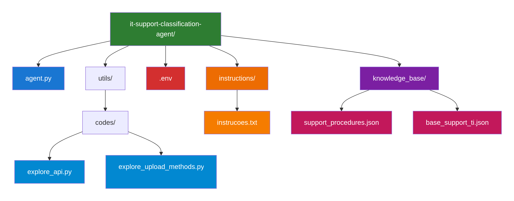
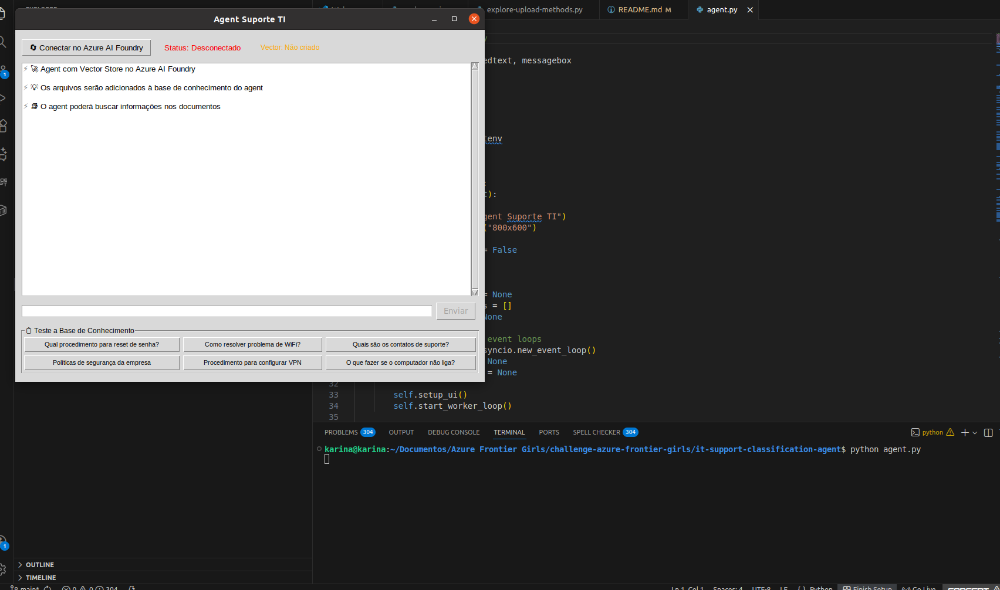
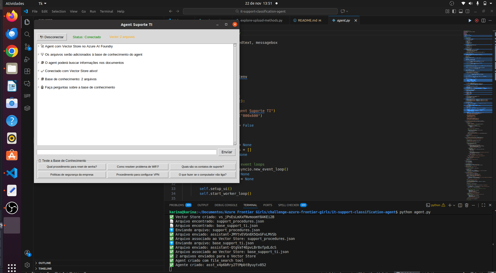
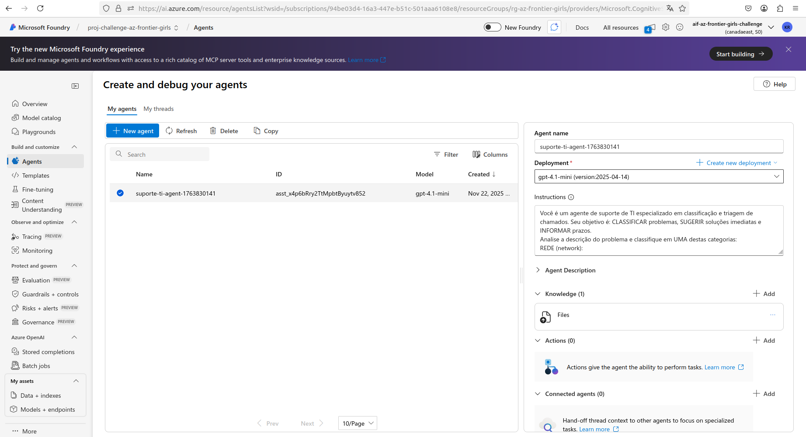
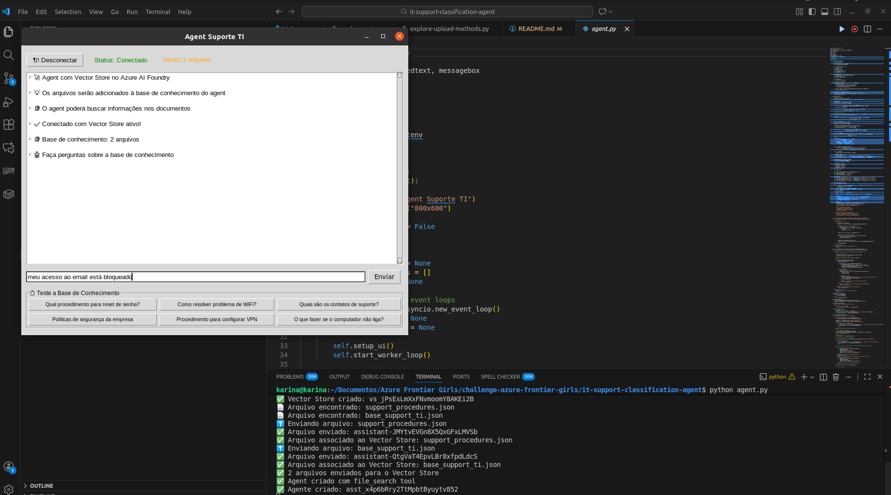
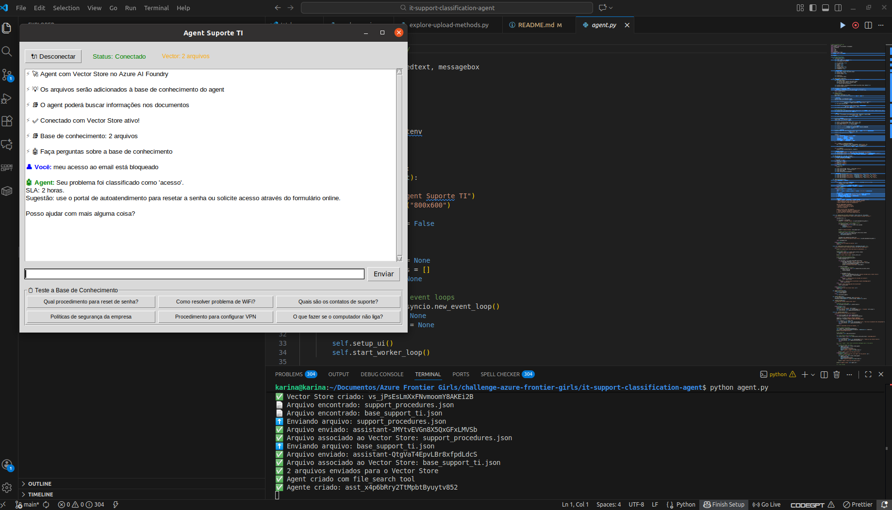
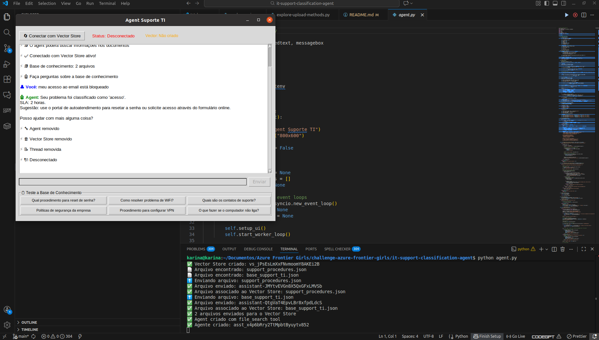
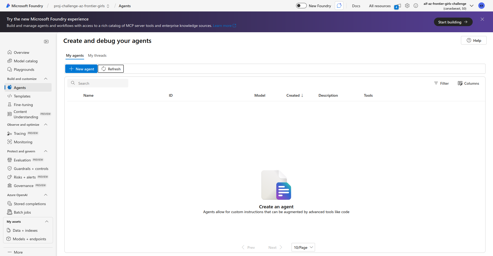

# Agent de Suporte TI com Azure AI Foundry

## 📋 Descrição do Projeto
Este projeto implementa um Agent de Suporte Técnico inteligente que utiliza Azure AI Foundry com Vector Store para fornecer respostas baseadas em uma base de conhecimento corporativa. O agent é capaz de buscar informações em documentos de suporte técnico e responder perguntas de forma contextualizada.

🎥 **[Assista o vídeo de demonstração](https://drive.google.com/file/d/1sLA2B7G1eQeW84TH-mliDwMQ4FtwZ2yh/view?usp=drive_link)**

## 🎯 Objetivo
- Criar uma interface gráfica interativa onde usuários possam:

- Consultar procedimentos de suporte técnico

- Obter informações sobre políticas da empresa

- Acessar contatos de suporte

- Resolver problemas comuns de TI

- Utilizar uma base de conhecimento dinâmica via Vector Store

## 🏗️ Arquitetura do Sistema

## Fluxo de Dados:

- Interface do Usuário (Tkinter) → Envia perguntas

- Agent Local → Processa e encaminha para Azure AI

- Azure AI Foundry → Executa o agent com Vector Store

- Vector Store → Busca na base de conhecimento

- Resposta → Retorna para interface do usuário

## 🛠️ Tecnologias Utilizadas

### Backend & AI

- Python 3.10+
- Microsoft Azure AI Foundry
- Agent Framework
    - Azure AI Agents - Framework para criação de agents
    - Azure Identity - Autenticação e autorização
    - Vector Stores - Armazenamento e busca semântica

### Frontend & Interface

- Tkinter - Interface gráfica nativa do Python

- Threading - Processamento assíncrono

- Asyncio - Programação assíncrona

## Gerenciamento de Dados

- JSON - Estruturação de dados

- Arquivos de texto - Base de conhecimento

- Environment Variables - Configurações sensíveis

### 📁 Estrutura do Projeto

📄 **Arquivos Python (azul)**: Código principal e scripts

🔐 **Configuração (vermelho)**: Variáveis de ambiente

📁 **Diretórios (verde/roxo/laranja)**: Organização do projeto

📄 **Dados (rosa)**: Arquivos de conhecimento e instruções

## 🔧 Configuração e Instalação

### Pré-requisitos

- Python 3.10 ou superior

- Conta Azure com acesso ao AI Foundry

- Credenciais de acesso ao Azure -> utilizar azure CLI -> `az login`

### Instalação

- Clone o repositório
`
    git clone <repository-url>
    cd it-support-classification
`

- Crie um ambiente virtual
`
    python -m venv .venv
    source .venv/bin/activate`  # Linux/Mac ou
  
    `.venv\Scripts\activate`     # Windows
  
- Configure as variáveis de ambiente

    `cp .env.example .env `
  
### Edite o arquivo .env com suas credenciais

- Variáveis de Ambiente
    - `AZURE_AI_PROJECT_ENDPOINT=https://your-project.ai.azure.com/`
    - `AZURE_AI_MODEL_DEPLOYMENT_NAME=your-model-name`

## 🚀 Como Executar

- Ative o ambiente virtual: source .venv/bin/activate

- Execute o agent: `python agent.py` ou `uv run agent.py`

- Interface Gráfica

    - Clique em "Conectar com Vector Store"

    - Aguarde a conexão e upload dos arquivos

    - Faça perguntas usando os exemplos ou digite suas próprias

## 📊 Funcionalidades

### ✅ Conectividade

- Conexão automática com Azure AI Foundry

- Criação de Vector Store dinâmico

- Upload de arquivos para base de conhecimento

### ✅ Interface

- Chat interativo em tempo real

- Exemplos pré-definidos para teste

- Status de conexão visual

- Indicador de arquivos carregados

### ✅ Processamento

- Busca semântica na base de conhecimento

- Respostas contextuais baseadas em documentos

- Processamento assíncrono para não bloquear a UI

### 🔍 Exemplos de Uso

O agent pode responder perguntas como:

- "Qual procedimento para reset de senha?"

- "Como resolver problema de WiFi?"

- "Quais são os contatos de suporte?"

- "Procedimento para configurar VPN"

### Passo a passo:

- Executar o agent: `python agent.py`:

- Conectar o agent na Azure AI Foundry:

- O agent é criado com base de conhecimento:

- Faça perguntas e valide as respostas:

    - Pergunta:
        

    - Resposta:
        

- Desconectar o agent:

- O agente será removido do Azure AI Foundry:

## 🛡️ Segurança

- Autenticação via Azure Default Credential

- Variáveis sensíveis em arquivo .env

- Conexões seguras com endpoints Azure

## 🔄 Monitoramento e Logs

O sistema fornece logs detalhados:

- Status de conexão com Azure

- Upload de arquivos para Vector Store

- Criação de agents e threads

- Processamento de mensagens

- Tratamento de erros

## 🐛 Solução de Problemas

### Erros Comuns

- Variáveis de ambiente não configuradas

    - Verifique o arquivo .env

    - Confirme as credenciais Azure

- "Event loop is closed"

    - Reinicie a aplicação

    - Verifique a configuração do asyncio

- Falha no upload de arquivos

    - Verifique permissões da pasta knowledge_base

    - Confirme o formato dos arquivos (.json, .txt, .md, .pdf)

### Logs de Debug

- Execute os scripts de exploração para diagnóstico que estão em `./utils/exporation-codes`:
    - `python test-connection.py`
    - `python test-vector-store.py`

## Referências

- [Agent Framework](https://github.com/microsoft/agent-framework/blob/main/python/samples/getting_started/agents/azure_ai_agent/azure_ai_with_existing_agent.py)
- [Azure AI Foundry](https://learn.microsoft.com/en-us/azure/ai-foundry/how-to/fine-tune-serverless?tabs=text-generation&pivots=foundry-portal)
- [Build and consume vector indexes in Microsoft Foundry portal](https://learn.microsoft.com/en-us/azure/ai-foundry/how-to/index-add?view=foundry-classic)
- [Tkinter](https://docs.python.org/pt-br/3.13/library/tkinter.html)
- [Tokens Explicados](https://blog.nvidia.com.br/blog/tokens-ia-explicados/)
- [Regioes dos modelos](https://learn.microsoft.com/en-us/azure/ai-foundry/agents/concepts/model-region-support?tabs=global-standard)

## 📈 Próximos Passos

- Criar versão web-based (Azure Functions + Github Pages)

- Implementar métricas de uso

- Implementar histórico de conversas

- Adicionar múltiplos Vector Stores

- Integrar com banco de dados para persistência

- Adicionar autenticação de usuários

## 👥 Contribuição

- Fork o projeto

- Crie uma branch para sua feature
                                                                                                                                                                                                                                    
- Commit suas mudanças

- Push para a branch

- Abra um Pull Request
                                                                                        

## 🤝 Suporte

- Para issues e dúvidas:                                                                                                                                

    - Abra uma issue no repositório
    
    - Consulte a documentação do Azure AI Foundry
    
    - Verifique os logs de execução

---  

#### Desenvolvido com ❤️ usando Azure AI Foundry e Python
